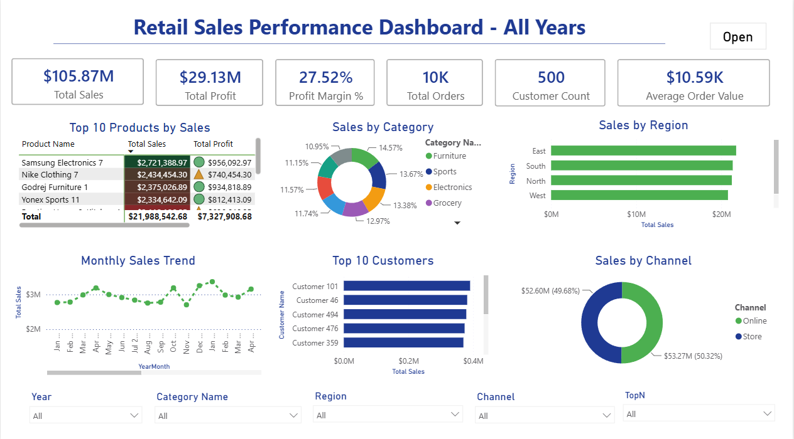
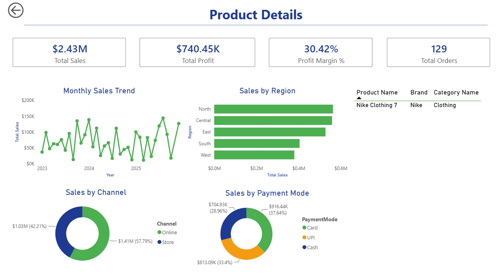
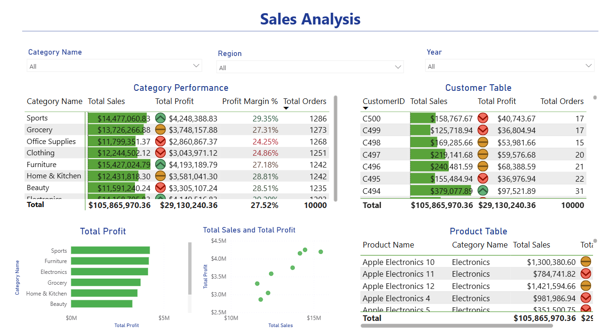

# Retail Sales Performance Dashboard

## Project Overview

This project is an interactive Retail Sales Dashboard developed using Microsoft Power BI.

It helps analyze sales performance across:

- Products
- Customers
- Regions
- Categories
- Sales Channels
- Payment Modes

---

## Dashboard Features

- KPI Cards
- Monthly Sales Trend
- Dynamic Report Title
- Dynamic Top N Products
- Drillthrough Page
- Custom Tooltips
- Bookmark Navigation
- Interactive Slicers
- Conditional Formatting

---

## Tools Used

- Microsoft Power BI Desktop
- Power Query
- DAX
- Data Modeling

---

## Dashboard Preview

### Main Dashboard

### Product Details

### Sales Analysis

---

## Author

Preethi Kumar
